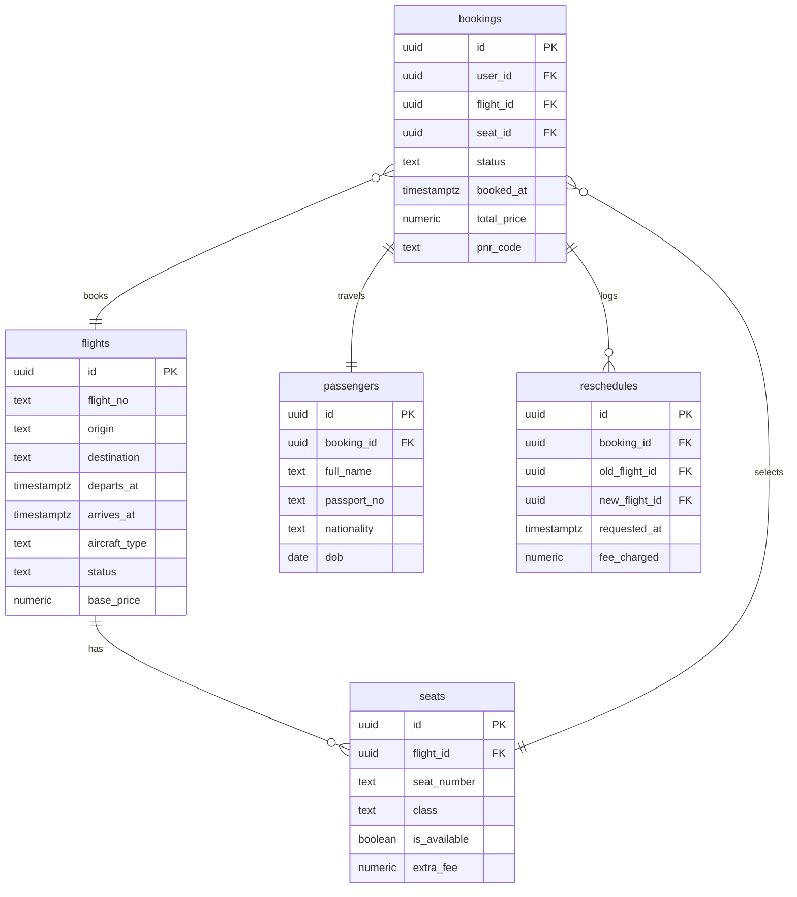

# ✈️ AeroGlide: Flight Management Web App (PWA)

AeroGlide is a premium, production-grade Progressive Web App (PWA) built to streamline flight booking, visual seat selection, and booking management (cancellations & rescheduling). It features atomic transaction guarantees, database-level safety triggers, real-time seat status updates, and offline capability.

---

## 🌟 Key Features

* **Task 01: Seamless Booking Flow**
  * Advanced search console for origin, destination, date, and passenger counts.
  * Interactive flights search listings presenting pricing, duration, and seat availability.
  * Passenger validation forms (Full Name, Passport Number, Nationality, DOB).
  * Auto-generated unique 6-character PNR codes on booking confirmation.
* **Task 02: Interactive Real-Time Seat Map**
  * Responsive, touch-friendly aircraft cabin grid (First, Business, and Economy zones).
  * Color-coded availability (Available, Occupied, Selected, Your Seat) with tooltips.
  * **Realtime Synchronization:** Subscribes to Supabase Postgres changes to update occupied seats live across devices without reloading.
* **Task 03: Booking Management (Cancel & Reschedule)**
  * **Rescheduling Wizard:** Swap flights on the same route with automatic calculation of base fare and class fee differences.
  * **Atomic Cancellations:** Atomically frees seats and cancels tickets.
  * **2-Hour Safe Trigger:** DB-level constraint prevents users from cancelling or changing flights within 2 hours of departure.
* **Task 04: Secure State Management**
  * Persistent booking flow states via Zustand so users can resume bookings after closing a tab.
  * **Security First:** Uses `partialize` configuration to automatically exclude sensitive passenger data (like passport numbers) from being saved to the client's local storage.
* **Task 05: Offline-Capable PWA**
  * Fully configured Service Workers (`next-pwa`) with custom caching rules.
  * Offline dashboard allowing users to review their booked tickets without an active internet connection.
  * Dedicated offline fallback page.

---

## 🛠️ Tech Stack & Architecture

* **Framework:** Next.js 14+ (App Router, Client Components optimized)
* **Styling:** Tailwind CSS with custom glassmorphism and modern dark mode design tokens
* **Database & Auth:** Supabase (PostgreSQL, Realtime replication, RPC triggers)
* **State Management:** Zustand with `persist` and `partialize` middleware
* **Service Workers:** Workbox via `next-pwa`

---

## 💾 Database Schema & Security

The database schema migrations are located in the `/supabase/migrations/` folder.



### 🔒 Core Safety Features
1. **Row Level Security (RLS):** All tables have RLS policies enabled. Users can only select/update bookings and passenger rows belonging directly to their authenticated `auth.uid()`.
2. **Atomic Race-Condition Protection:** Booking, cancelling, and rescheduling use PostgreSQL stored procedures (RPCs) utilizing `SELECT FOR UPDATE` to write lock seat records, preventing double-bookings.
3. **DB-Level 2-Hour Rule Constraint:** The `trg_check_cancellation_time` trigger ensures no cancellation or reschedule is processed if departure is less than 2 hours away.

---

## 📦 Local Setup Instructions

Follow these simple steps to run this project locally:

### 1. Clone & Install Dependencies
```bash
# Clone the repository and navigate to the directory
cd aeroglide-flight-pwa

# Install packages
npm install
```

### 2. Set Up Environment Variables
Create a `.env.local` file in the root of the project:
```env
NEXT_PUBLIC_SUPABASE_URL=https://your-project-id.supabase.co
NEXT_PUBLIC_SUPABASE_ANON_KEY=eyJhbGciOiJIUzI1NiIsInR5cCI6IkpXVCJ9...
```

### 3. Load Supabase Schemas & Seed Data
* Go to your **Supabase Dashboard** -> **SQL Editor**.
* Copy the SQL query from `/supabase/migrations/20260520000000_initial_schema.sql` and run it.
* Under **Database** -> **Replication** -> **Source tables**, verify that replication is enabled on the `seats` table to support real-time updates.

### 4. Running the App
```bash
# Start Next.js development server
npm run dev
```
Open **[http://localhost:3000](http://localhost:3000)** in your browser.

---

## 🔑 Test Account Credentials

The database migration automatically seeds a verified test user account to speed up evaluation:
* **Email:** `test@gmail.com`
* **Password:** `password123`

*(Alternatively, you can create a new account using the Sign Up option on the login page).*

---

## ⚡ Production Build & PWA Testing

To compile the application production bundle and test service worker logic:
```bash
# Build
npm run build

# Start production server
npm run start
```

### Zustand Store Structure Details
* **`useFlightStore`:** Stores query search parameters, selected flights, and current passenger inputs. The search query and steps are saved to `localStorage` using Zustand's `persist` middleware, but `passport_no` is sanitized using `partialize` to ensure compliance with personal data privacy guidelines.
* **`useUserStore`:** Holds authenticated Supabase user metadata and a list of offline-cached bookings. When the device loses network connectivity, the user store provides cached bookings instantly to avoid broken pages.
